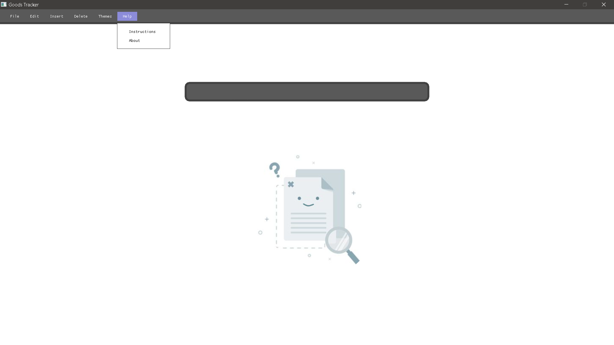
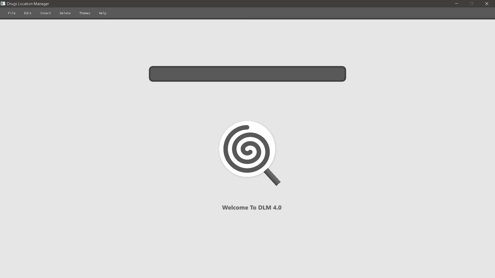
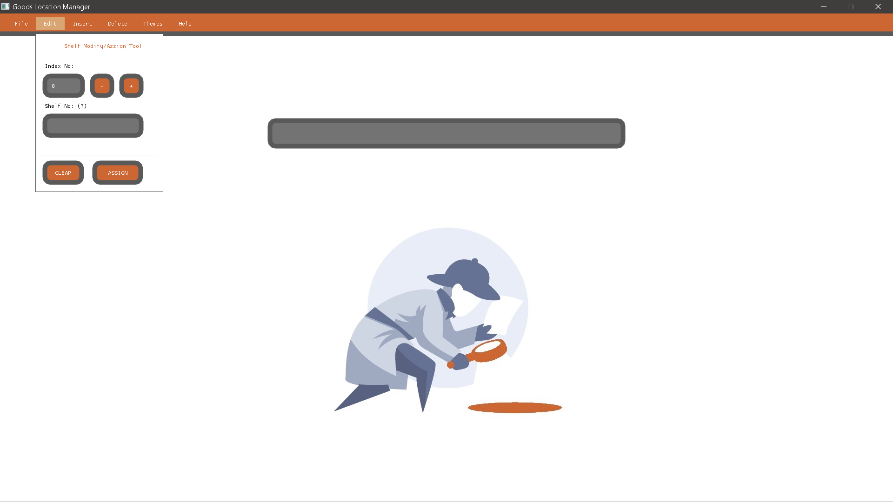
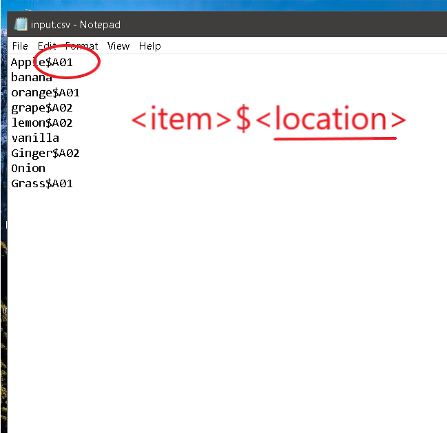

# Goods-Location-Manager-CSVBased-
A Non-Profit Simple Software To Manage Location of Goods By Search, Insert, Modify and Delete data stored in a *.csv File

(portable standalone .exe file | Windows-10)

Theme: Asteroid

Theme: Lollipop

Theme: SpringHeart

### Instructions For usage :-

This software supports the usage of *.csv* files as input and Performs operations such as Search, Insertion, Updation and Deletion on the supplied *.csv* file.

Note:- Target File Must be Renamed As *'input.csv'* for the software to Recognise the file.
If No File is Available Use 'Insert Menu' To create A fresh *'input.csv'* file.

## Working :-

This Simple Utility Recognises the shelf No./Rack/Location of the Item by Reading the text followed by *$* symbol.
If No *$* is present, it indicates that No shelf/Location is Assigned to that Item.

The Utility is able to Modify the shelf No./Rack No. by changing The values followed by *$* symbol or
Assigning a new location if not present.

### Features:-

1. Searching Items By Shelf No./Rack No./Location.
2. Viewing All Items that have location/Shelf Assigned to it (by using *$* As keyword).
3. Inserting New Item.
4. Updating Item Location/Shelf No.
5. Deleting Item from *input.csv* file permanently.

## Limitations :-

1. When Multiple *$* Symbols are present. First Occurence is selected.
2. Supports only *.csv* file.

(workaround: see solution below)

## Solution :-

For a more Advanced and practical Approach, an Android application was created using same principles, but uses a much better algorithm.

1. Supports Multiple and most common spreadsheet/excel formats.
2. Searches For '#:' Instead of '$' in a row/line. and if multiple occurences are found, then the last occurence is selected.
3. Exporting,Editing,Deleting..
4. Parsing Large Datasheets(Depends on Processor)

https://play.google.com/store/apps/details?id=com.csslovv.legacy

## License:-

MIT License
